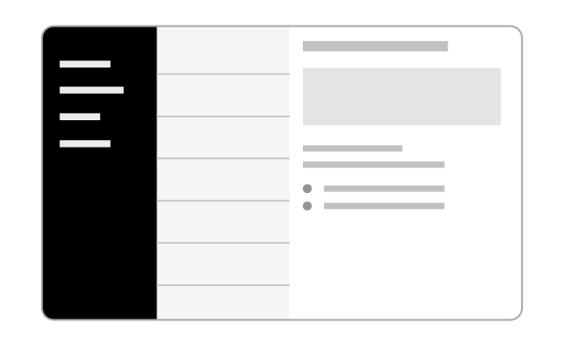

# react-native-three-column-layout



This is a component that provides three-column layout with animation support for tablet displays.

## Installation

```sh
npm install react-native-three-column-layout
```

## Usage

```jsx
import ThreeColumnLayout from 'react-native-three-column-layout'

return (
  <ThreeColumnLayout
    renderLeftView={() => <View style={[styles.box, styles.leftColumn]} />}
    renderMiddleView={() => <View style={[styles.box, styles.middleColumn]} />}
    renderRightView={() => <View style={[styles.box, styles.rightColumn]} />}
  />
)

const styles = StyleSheet.create({
  box: {
    flex: 1,
  },
  leftColumn: { backgroundColor: 'red' },
  middleColumn: { backgroundColor: 'yellow' },
  rightColumn: { backgroundColor: 'blue' },
})
```

## Props

```ts
type RenderView = (callbacks: ThreeColumnLayoutProps) => React.ReactNode
type Props = {
  renderLeftView: RenderView
  renderMiddleView: RenderView
  renderRightView: RenderView
  leftViewVisible?: boolean
  middleViewVisible?: boolean
  leftViewWidth?: number
  middleViewWidth?: number
}
```

## Contributing

See the [contributing guide](CONTRIBUTING.md) to learn how to contribute to the repository and the development workflow.

## License

MIT
